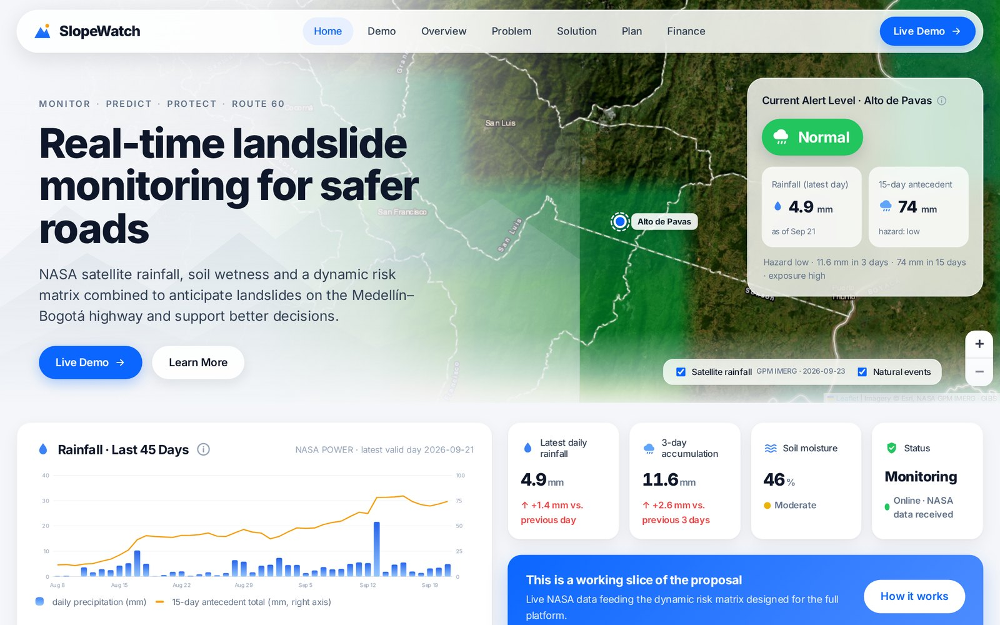
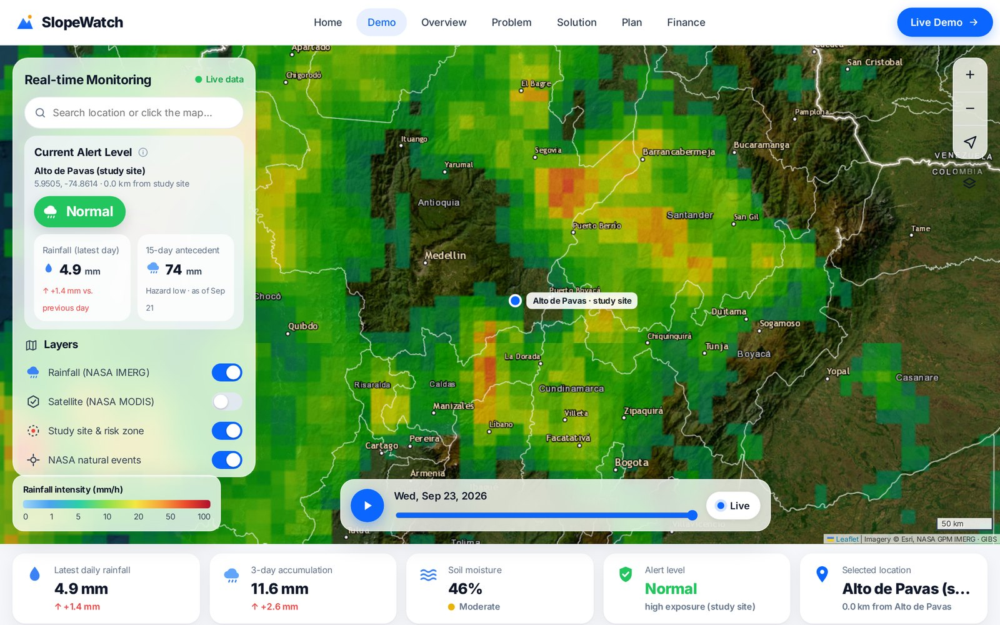
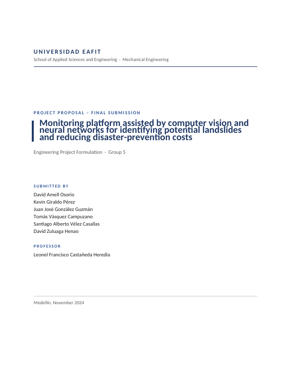
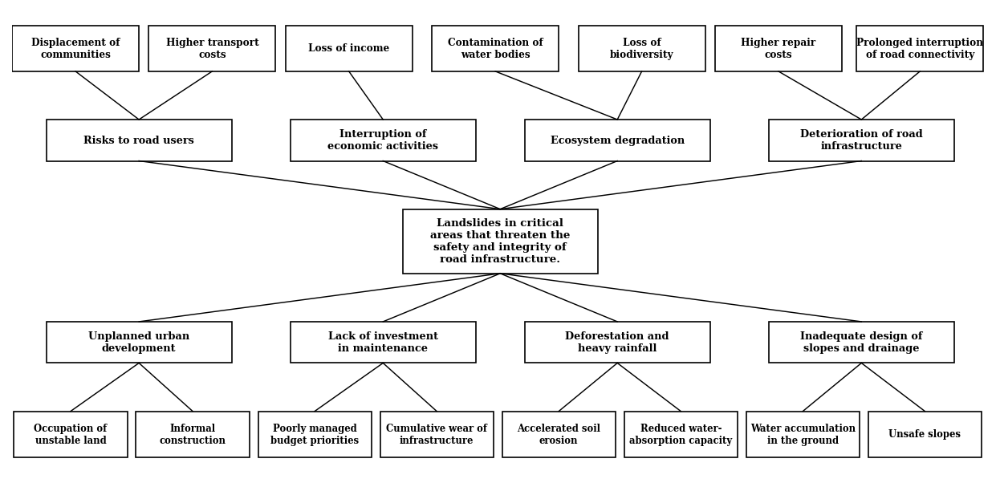
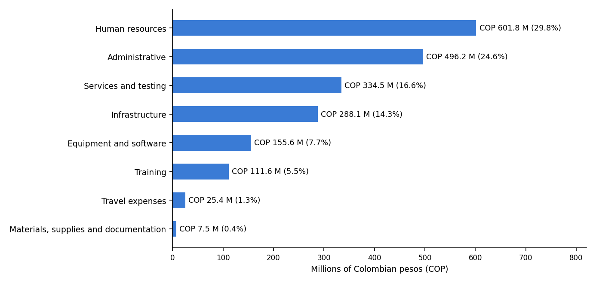
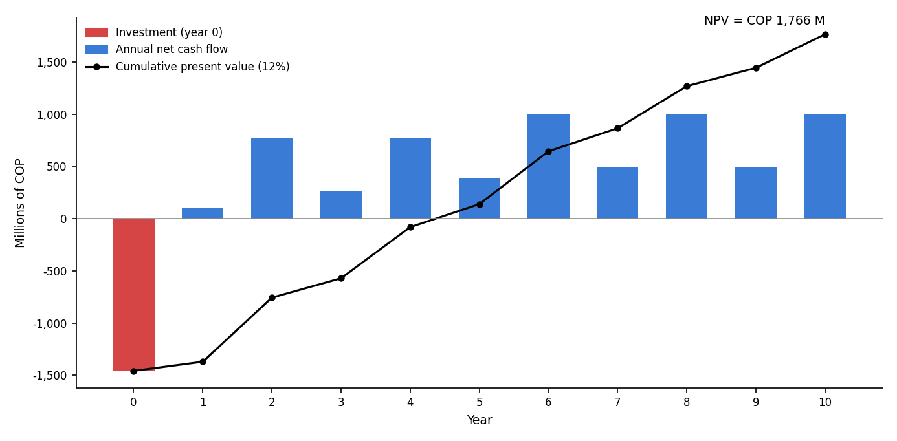

# AI-Assisted Landslide Monitoring Platform — Project Proposal

Engineering project proposal (*anteproyecto*) for a monitoring platform that uses **computer vision and neural networks** to identify potential landslides and reduce prevention costs along the **Medellín–Bogotá highway (Ruta 60)**, in Antioquia, Colombia.

Developed for the *Formulación de Proyectos de Ingeniería* course at **Universidad EAFIT** (Group 5, 2024), following the Colombian **MGA** (Metodología General Ajustada) project-formulation methodology.

> The original report is in Spanish; an **English translation** is available: [`Final_Report_G5_English.pdf`](01_Final_Report/Final_Report_G5_English.pdf) · [`.docx`](01_Final_Report/Final_Report_G5_English.docx).

### 🌐 Website and live demo

**▶ [slopewatch-landslide.vercel.app](https://slopewatch-landslide.vercel.app)** — English presentation of the proposal with a working demo of the early-warning platform, fed by **NASA open data in real time**.

[](https://slopewatch-landslide.vercel.app)


| Page | What it shows |
|---|---|
| [**Home**](https://slopewatch-landslide.vercel.app) | Current alert level at Alto de Pavas over a satellite map, 45-day rainfall chart, key indicators, dynamic risk matrix and recent NASA natural events |
| [**Demo**](https://slopewatch-landslide.vercel.app/demo.html) | Full-screen interactive map: search any place or click the map to get its rainfall, soil moisture and alert level; toggle NASA layers; replay the last 7 days of satellite rainfall |
| [Overview](https://slopewatch-landslide.vercel.app/overview.html) · [Problem](https://slopewatch-landslide.vercel.app/problem.html) · [Solution](https://slopewatch-landslide.vercel.app/solution.html) · [Plan](https://slopewatch-landslide.vercel.app/plan.html) · [Finance](https://slopewatch-landslide.vercel.app/finance.html) | The proposal: study site and problem, platform and alternatives, 24-month plan, budget and financial evaluation |

<p align="center"><a href="https://slopewatch-landslide.vercel.app/demo.html"></a></p>
<p align="center"><em>Interactive demo — search or click any point to get its NASA rainfall, soil moisture and alert level.</em></p>

**Data sources (no API keys):**

- **NASA GPM IMERG** satellite rainfall, via NASA GIBS map tiles.
- **NASA POWER** daily precipitation and surface soil wetness for the selected point.
- **NASA MODIS Terra** true-color imagery (GIBS and Worldview snapshots).
- **NASA EONET** landslide, flood and severe-storm events in north-western South America.
- Esri basemaps and OpenStreetMap Nominatim place search.

**How the alert works:** antecedent rainfall (3-day and 15-day totals) sets the rainfall hazard, which is raised one level when the soil is saturated. The dynamic risk matrix (R = H × V × E) then combines it with the section's exposure to give the alert level: *Normal*, *Watch*, *Warning* or *Alert*. The thresholds are illustrative; the full platform would calibrate them with local landslide records, IDEAM and SIATA gauges and the neural-network detections described in the proposal.

The site is static (HTML, CSS and JavaScript with Leaflet, no build step) and lives in [`website/`](website/). It is deployed on Vercel with *Root Directory* set to `website`, so every push to `main` updates it. See [`website/README.md`](website/README.md) for details.

### ▶ Videos

- **[Business model](https://youtu.be/d8uXTJK8ZDg)** — presentation of the business model behind the platform.
- **[Final project](https://youtu.be/gFdzo9rPchc)** — presentation of the final project.
- **[Pitch](https://youtu.be/J5s8gfeZvxI)** — project pitch.

*All three videos are in Spanish.*

## Highlights

| Item | Value |
|---|---|
| Location | San Francisco (Alto de Pavas), Cocorná and San Luis — Antioquia |
| Duration | 24 months |
| Total budget | COP 2,020,666,816 |
| Funding | Funder 75.7 % · EAFIT counterpart 22.1 % · URBAM ally 2.2 % |
| Selected alternative | GIS monitoring platform with Industry 4.0 technologies (68 / 75 in the selection matrix) |
| NPV (12 %, 10 years, economic prices) | COP 1,766 million |
| IRR | 31.8 % |
| Benefit/cost ratio | 2.08 |
| Discounted payback | 4.4 years |

The proposal combines remote sensing, satellite rainfall data and deep-learning models (YOLO-based object detection) with a web GIS platform so that highway concessions and authorities can intervene before a slope fails.

### From the final report

<p align="center">
  <a href="01_Final_Report/Final_Report_G5_English.pdf"></a>
</p>

**Problem tree.** Landslides in critical areas are driven by unplanned urban development, lack of maintenance investment, deforestation with heavy rainfall, and inadequate slope and drainage design.



**Budget and financial evaluation.** Human resources, administration and services and testing make up 71 % of the COP 2.02 billion budget. At economic prices the project recovers its investment in 4.4 years, with an NPV of COP 1,766 million.

| Budget distribution by item | Annual net cash flow and cumulative present value |
|---|---|
|  |  |


## Repository structure

```
01_Final_Report/
├── Final_Report_G5_Corrected.pdf     ← final corrected report
├── Final_Report_G5_Corrected.docx    ← editable version
├── Final_Report_G5_English.pdf       ← English translation
├── Final_Report_G5_English.docx      ← English translation (editable)
├── Grading_Rubric_G5.pdf             ← instructor rubric used for the corrections
02_Progress_Deliverables/
├── A01_Technical_System/             ← technical system and title selection
├── A02_Proposal_Summary_Background/
├── A03_Stakeholders_Problem/         ← stakeholder and problem-tree analysis
├── A04_State_of_the_Art_Articles/
├── A05_State_of_the_Art_Standards/
├── A06_Objectives_Alternatives/
├── A07_General_Specific_Objectives/
├── A08_Project_Structure_Products/   ← WBS and expected products
├── A09_Methodology_Logical_Framework/
├── A10_Impacts_Dissemination/
├── A11_Schedule_Budget/
└── A12_Financial_Evaluation/
website/                              ← proposal website and live NASA demo (Vercel)
docs/images/                          ← images used in this README
```

## Report contents

1. Technical system identification and proposal data (entities, location, team)
2. Alignment with public policy (SDGs, National, Departmental and Municipal Development Plans)
3. Executive summary and background
4. Stakeholder analysis
5. Problem analysis (problem tree, causes and effects, magnitude)
6. State of the art — standards, indexed articles, books and patents
7. Objectives tree and alternatives analysis (weighted selection matrix)
8. General and specific objectives, work breakdown structure and products
9. Methodology and logical framework matrix
10. Impacts and dissemination strategy
11. Schedule (Gantt) and detailed budget by item and funding source
12. Financial evaluation — income, benefits, investment and O&M at economic prices, net cash flow, NPV / IRR / B-C, sensitivity analysis
13. Conclusions and APA references

## Note on references

Books, standards, journal articles and course guides used during the research are **not included** in this repository because they are copyrighted by third parties. Full citations are listed in the report's reference section.

## Team

David Zuluaga Henao · David Amell Osorio · Kevin Giraldo Pérez · Juan José González Guzmán · Tomás Vásquez Campuzano · Santiago Alberto Vélez Casallas 

Instructor: Leonel Francisco Castañeda Heredia — Universidad EAFIT, Medellín, 2024
